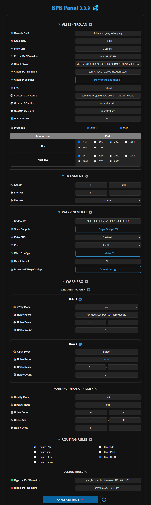

<h1 align="center">💦 BPB 面板</h1>

#### 🌏 [English](README.md)

  

 

## 介绍

该项目是为 <a href="https://github.com/yonggekkk/Cloudflare-workers-pages-vless">Cloudflare-workers/pages 代理</a> 脚本开发的用户面板，由 <a href="https://github.com/yonggekkk">yonggekkk</a> 创建。

### 该面板有两种部署方式：

- 使用 **Cloudflare Worker** 部署
- 使用 **Cloudflare Worker** 部署
 

🌟 如果 **BPB Panel** 项目对您有帮助，您的支持将是我的动力 🌟
<ul dir="rtl">
  <li><code>0x111EFF917E7cf4b0BfC99Edffd8F1AbC2b23d158</code> <strong>:USDT (BEP20)</strong></li>
</ul>

## 特性
 
<ol dir="rtl">
  <li><strong>免费</strong></li>
  <li><strong>用户友好的面板：</strong>轻松设置和获取配置及订阅链接。</li>
  <li><strong>多种协议：</strong>提供 VLESS、Trojan 和 Warp 的配置。</li>
  <li><strong>Warp Pro 订阅：</strong>提供针对伊朗特殊情况优化的 Warp 配置。</li>
  <li><strong>支持碎片：</strong>即使域名被封也可使用。</li>
  <li><strong>完整的路由规则：</strong>包括绕过伊朗、中国、俄罗斯网站，直接访问 LAN，屏蔽国内外广告和色情内容及 QUIC 协议。</li>
  <li><strong>代理链：</strong>可添加出口代理以稳定 IP。</li>
  <li><strong>支持多种应用：</strong>提供适用于 Xray、Sing-box 和 Clash 核心的订阅链接。</li>
  <li><strong>密码保护的面板：</strong>通过密码保护面板安全。</li>
  <li><strong>完全自定义设置：</strong>可扫描和设置干净 IP、代理 IP、DNS 服务器、端口、协议和 Warp 端点等。</li>
</ol>
  

## 安装、设置和使用方法
- [推荐的新 Pages 安装方法](docs/pages_upload_installation_zh.md)
- [Pages 安装](docs/pages_installation_fa.md)
- [Workers 安装](docs/worker_installation_fa.md)
- [如何使用面板](docs/configuration_fa.md)
- [常见问题 (FAQ)](docs/faq.md)
 

## 支持的应用程序

<table>
  <thead>
    <th>应用程序</th>
    <th>版本</th>
    <th>Fragment</th>
    <th>Warp Pro</th>
  </thead>
  <tbody  align="center">
    <tr>
      <td><b>v2rayNG</b></td>
      <td>1.8.19 及以上</td>
      <td>✔️</td>
      <td>❌</td>
    </tr>
    <tr>
      <td><b>v2rayN</b></td>
      <td>6.42 及以上</td>
      <td>✔️</td>
      <td>❌</td>
    </tr>
    <tr>
      <td><b>v2rayN-Pro</b></td>
      <td>1.4 及以上</td>
      <td>✔️</td>
      <td>✔️</td>
    </tr>
    <tr>
      <td><b>Nekobox</b></td>
      <td></td>
      <td>❌</td>
      <td>❌</td>
    </tr>
    <tr>
      <td><b>Sing-box</b></td>
      <td>1.10.1 及以上</td>
      <td>❌</td>
      <td>❌</td>
    </tr>
    <tr>
      <td><b>Streisand</b></td>
      <td></td>
      <td>✔️</td>
      <td>❌</td>
    </tr>
    <tr>
      <td><b>V2Box</b></td>
      <td></td>
      <td>❌</td>
      <td>❌</td>
    </tr>
    <tr>
      <td><b>Shadowrocket</b></td>
      <td></td>
      <td>❌</td>
      <td>❌</td>
    </tr>
    <tr>
      <td><b>Nekoray</b></td>
      <td></td>
      <td>✔️</td>
      <td>❌</td>
    </tr>
    <tr>
      <td><b>Hiddify</b></td>
      <td>2.0.5 及以上</td>
      <td>❌</td>
      <td>✔️</td>
    </tr>
    <tr>
      <td><b>NikaNG</b></td>
      <td></td>
      <td>✔️</td>
      <td>✔️</td>
    </tr>
    <tr>
      <td><b>Clash Meta</b></td>
      <td></td>
      <td>❌</td>
      <td>❌</td>
    </tr>
    <tr>
      <td><b>Clash Verg Rev</b></td>
      <td></td>
      <td>❌</td>
      <td>❌</td>
    </tr>
    <tr>
      <td><b>FLClash</b></td>
      <td></td>
      <td>❌</td>
      <td>❌</td>
    </tr>
  </tbody>
</table>

---
## 星标数量随时间变化

---
### 特别感谢

- CF-vless 代码作者 <a href="https://github.com/3Kmfi6HP/EDtunnel">3Kmfi6HP</a>
- CF 优选 IP 程序作者 <a href="https://github.com/badafans/Cloudflare-IP-SpeedTest">badafans</a>，<a href="https://github.com/XIU2/CloudflareSpeedTest">XIU2</a>

---
有关主脚本的详细教程，请访问 <a href="https://ygkkk.blogspot.com/2023/07/cfworkers-vless.html">Yongge 的博客和视频教程</a>。
