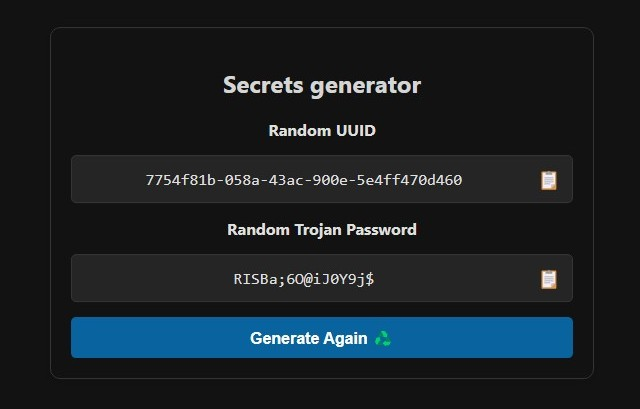
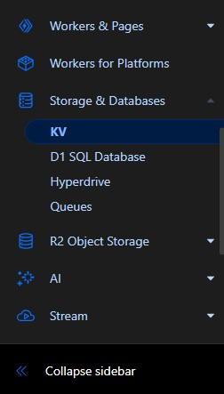
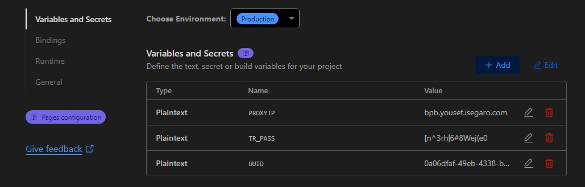

<h1 align="center">通过 Cloudflare Pages 上传安装</h1>

## 简介
您可能知道，Cloudflare 上有两种方法可以构建代理：Worker 和 Pages。值得注意的是，较为常用的 Worker 方法有一个限制，即每天最多只能发送十万次请求。当然，这个限制对于2-3个人的使用是足够的。为了绕过 Worker 方法的限制，我们可以将一个域名连接到 Worker 上，这样就可以实现无限制（这似乎是 Cloudflare 的一个漏洞）。然而，Pages 方法没有这个限制（最近有报告称这种方法也可能会有限制，建议自行测试）。由于我们在此方法中使用了名为 Pages functions 的功能，您仍然会收到一封电子邮件，通知您已达到 100k 的使用限制，即使您使用的是个人域名，您也会收到这封邮件。**但最终的经验表明，您的服务不会中断。**

## 第一步 - Cloudflare Pages
如果您没有 Cloudflare 账户，请从[这里](https://dash.cloudflare.com/sign-up)注册一个账户（只需要一个电子邮件地址即可注册，鉴于 Cloudflare 的敏感性，建议使用像 Gmail 这样的有效电子邮件）。从[这里](https://github.com/bia-pain-bache/BPB-Worker-Panel/releases/latest/download/worker.zip)下载 Worker 的 zip 文件。

现在，在您的 Cloudflare 账户中，从左侧菜单进入 `Workers and Pages` 部分，点击 `Create Application` 并选择 `Pages`：

  

点击 `Upload assets` 进入下一步。这里有一个 `Project Name`，它将成为您面板的域名，请选择一个不包含 bpb 的名称，否则您的账户可能会被 Cloudflare 识别。点击 `Create Project`。在此步骤中，您需要上传之前下载的 Zip 文件，点击 `Select from computer`，然后选择 `Upload zip` 并上传文件，最后点击 `Deploy site`，然后 `Continue to project`。

您的项目已经创建，但尚不可用。在 `Deployment` 页面中，点击 `Production` 部分的 `visit`，您会看到一个错误，提示您需要先设置 UUID 和 Trojan Password，点击链接，在浏览器中打开它，留待下一步使用。

  

## 第三步 - 创建 Cloudflare KV 并设置 UUID 和 Trojan 密码
从左侧菜单进入 KV 部分：

  

点击 `Create`，给它一个自定义名称并添加。

返回 `Workers and Pages` 部分，进入您创建的 Pages 项目，根据下图进入 `Settings` 部分：

  

在这里，找到 `Bindings` 部分，点击 `Add` 并选择 `KV Namespace`，`Variable name` 必须是 `kv`（如图所示），选择您在第二步创建的 `KV namespace` 并保存。

  

KV 的设置完成了。

在 `Settings` 部分，您会看到 `Variables and Secrets`，点击 `Add variable`，在第一个框中输入大写的 `UUID`，UUID 可以从上一步的链接中获取并复制到 Value 部分，然后保存。再次点击 `Add variable`，在第一个框中输入大写的 `TR_PASS`，Trojan 密码也可以从上一步的链接中获取并复制到 Value 部分，然后保存。

现在，从页面顶部点击 `Create deployment`，再次上传相同的 zip 文件。

现在您可以返回 `Deployments` 页面，在 `Production` 部分点击 `visit`，然后在末尾添加 `panel/` 进入面板。设置和注意事项可以在[主教程](configuration_fa.md)中找到。安装完成，后续的说明可能对大多数人不必要。

  
<h1 align="center">高级设置（可选）</h1>

## 1- 固定 Proxy IP：

我们有一个问题，这段代码默认使用大量的 IP Proxy，每次连接到 Cloudflare 后面的站点（包括网络的大部分）时，会随机选择一个新的 IP，因此您的 IP 会不断变化。这种 IP 变化可能会对某些人造成问题（尤其是交易者）。从版本 2.3.5 开始，您可以通过面板更改 Proxy IP，更新订阅即可完成。但我建议使用以下方法，因为：

> [!CAUTION]
> 如果通过面板应用 Proxy IP，并且该 IP 失效，您需要替换一个 IP 并更新订阅。这意味着如果您已经分享了配置并更改了 Proxy IP，将没有效果，因为用户没有订阅来更新配置。因此，建议仅将此方法用于个人使用。但接下来我将介绍的第二种方法的好处是，通过 Cloudflare 仪表板进行，不需要更新配置。

  

要更改 Proxy IP，进入项目后，从 `Settings` 部分打开 `Environment variables`：

  

在这里，您需要指定值。每次点击 `Add`，输入一个并保存：

  

 

现在点击 `Add variable`，在第一个框中输入大写的 `PROXYIP`，IP 可以从以下链接获取，打开它们会显示一些 IP，您可以检查它们的国家并选择一个或多个：

>[Proxy IP](https://www.nslookup.io/domains/bpb.yousef.isegaro.com/dns-records/)

  

> [!TIP]
> 如果您想要多个 Proxy IP，可以用逗号分隔输入，例如 `151.213.181.145`,`5.163.51.41`,`bpb.yousef.isegaro.com`

现在从页面顶部点击 `Create deployment`，再次上传相同的 zip 文件，变更将生效。

  

## 2- 将域名连接到 Pages：

为此，进入 Cloudflare 仪表板，选择您的面板，从 `Workers and Pages` 部分进入 `Custom domains`，点击 `set up a custom domain`。这里需要您输入一个域名（请注意，您之前需要购买一个域名并在此账户中激活，这里不提供教程）。假设您有一个名为 bpb.com 的域名，在 Domain 部分可以输入域名或一个自定义子域名，例如 xyz.bpb.com，然后点击 `Continue`，在下一页点击 `Activate domain`。Cloudflare 会自动将 Pages 连接到您的域名（这可能需要一段时间，Cloudflare 自己说可能需要长达 48 小时）。在此之后，您可以从 `https://xyz.bpb.com/panel` 进入您的面板并获取新的订阅。

  

<h1 align="center">更新面板</h1>

要更新面板，请像创建步骤一样，从[这里](https://github.com/bia-pain-bache/BPB-Worker-Panel/releases/latest/download/worker.zip)下载新的 zip 文件。在您的 Cloudflare 账户中，进入 `Workers and Pages` 部分，进入您创建的 Pages 项目，从页面顶部点击 `Create deployment`，再次上传新的 zip 文件即可完成。